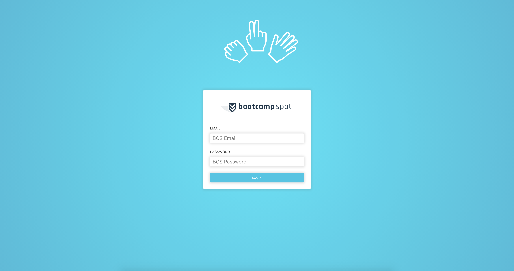

# [Fist To Five](https://trilogy-fist-to-five.herokuapp.com/)

# [Demo Video](https://drive.google.com/file/d/1bZw9BzNaH0-o9Dqv8Vci1POLkWAYQjZU/view)



#### Trilogy Hackathon Entry, 2019

Fist To Five is an instructor- and TA-facing web client that sends Fist to Five prompts to their students via a Slack Interactive Message. When the instructor or TA submits a prompt to Slack, a Slack poll is opened for a sixty-second window and the client establishes a websocket connection, so that students' responses may be viewed in real-time.

### Access the Demo Slack Channel
**Trilogy Staff**: feel free to contact me `@Jeff Reynolds` on the `trilogyed-instruction.slack.com` Slack Workspace and I will invite you to the demo Slack Channel to evaluate the integration. Configuring a new Workspace to work with a new deployment of the web client requires some setup detailed below:

### Configuring Slack to receive Interactive Messages via Webhook
1) Create a Slack Workspace, or use an existing Slack Workspace
2) Head to https://api.slack.com/apps?new_app=1. It will prompt you for an App Name and to select a Workspace. Enter "Fist to Five" as the App Name, and select to whichever Workspace you'd like to add this Slack App. Click Create App when finished.
3) Back in the Slack client, create a designated channel in your Workspace to receive the Interactive Messages--the demo Slack channel has a dedicated `#fisttofive` channel. _This is where additional work will need to be done for this app to scale--rather than send ing to a dedicated channel, the API will need to be used to send Interactive Messages to individual students._
4) Click **Incoming Webhooks**. Once there, toggle the switch at the top right to On, and click **Add New Webhook to Workspace** at the bottom-left of the main content panel. This will direct you to a new page prompting you to authorize the Slack integration on a particular channel in the Workspace. Select the channel you created in step 3, and click **Authorize**. (Note the Webhook URL it creates at the bottom of the Incoming Webhooks page--we'll need it to configure the Fist To Five web client later.)
5) Unfortunately, Slack doesn't support local request origins, so in development, we need to set up `ngrok`, which is a really handy tool that will give you an ephemeral domain name that will resolve to localhost.
  a) Register as a free user at https://ngrok.com/ and follow the steps [here](https://dashboard.ngrok.com/get-started).
  b) I personally installed it in `/usr/local/bin/ngrok`, so that I can use this tool for demos, etc. with a simple `ngrok http <YOUR PORT HERE>` command. See this [SO article](https://stackoverflow.com/questions/30188582/ngrok-command-not-found) for more info.
  c) The Fist To Five server-side Node application runs on port `3001` by default, so start `ngrok` at that port: `/path/to/ngrok http 3001`
  d) The **Forwarding** url in the command line output is the url that will now tunnel traffic from this url to `http://localhost:3001`. It's only temporary, and lasts for several hours, so beyond that, you'll need to start ngrok again and get a new forwarding url; if that happens, be sure to update the Slack API configuration we're about to update in the next step. Copy the forwarding url.
6) Back in the Slack API dashboard, on the left sidebar, select Features → **Interactive Components**. On this page, switch on **Interactivity** at the top right, and paste in the ngrok url, and append a `/slack` route path, so that the Express app can receive requests at the correct route. Overall, it should look something like this while we're in development:
```
http://7e7ad2c3.ngrok.io/slack
```
In production, our forwarding url will be changed to our production url.

That's it for this page. Click the green **Save Changes** button at the bottom right.

7) Allocate a directory for this app locally, clone this repo, and start the server process:
```
cd fist-to-five
npm i
node server.js
```
Open a new tab, and start the React dev server:
```
cd client
npm i
npm run start
```
8) No changes need to happen server-side, but we do need to adjust our Slack config client-side. The config variables to change can be found in `client/src/slack/config.js`. Under `DEV`, 1) update the `callbackId` value to reflect the development ngrok forwarding url, 2) update the `responseUrl` value to reflect the Incoming Webhook url (you can go to the Slack App dashboard, select **Incoming Webhooks**, and copy the webhook url to your clipboard for this), and 3) update the channel to reflect the channel you configured in step 3.
9) Deploying a new instance would require you to update the `callbackId` to the deployed site's domain name.

### Tech Stack
* React
* styled-components
* Socket.io
* Express
* Node.js
* MySQL and Sequelize
* Slack Interactive Messages and Webhooks

### Detailed Specifications
* Connections to websockets are only added when the user submits a prompt. This way, while many instructors or TAs from many universities may be using the service, they're only subscribed to the polls they created.
* Responses are anonymous--only numerical data regarding the prompt is persisted.
* If the student responds with a three or below, a warm message encourages them to get help during office hours.
* If the student responds with a four or above, a celebratory message encourages them to solidify their knowledge by explaining the concept to their peers.
* If the student answers, but the poll is no longer active, a poll timeout message indicates that they ran out of time to answer the poll. This prevents students from going back to unanswered polls if they weren't present to learn the material.